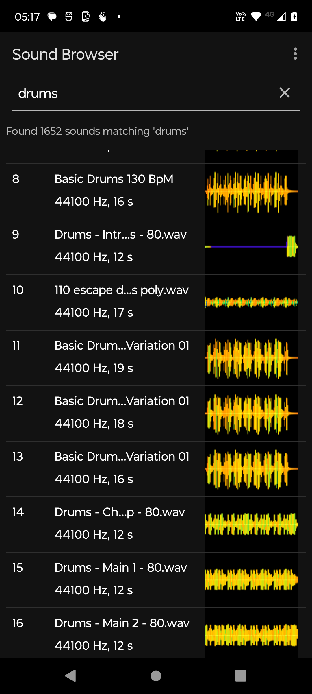
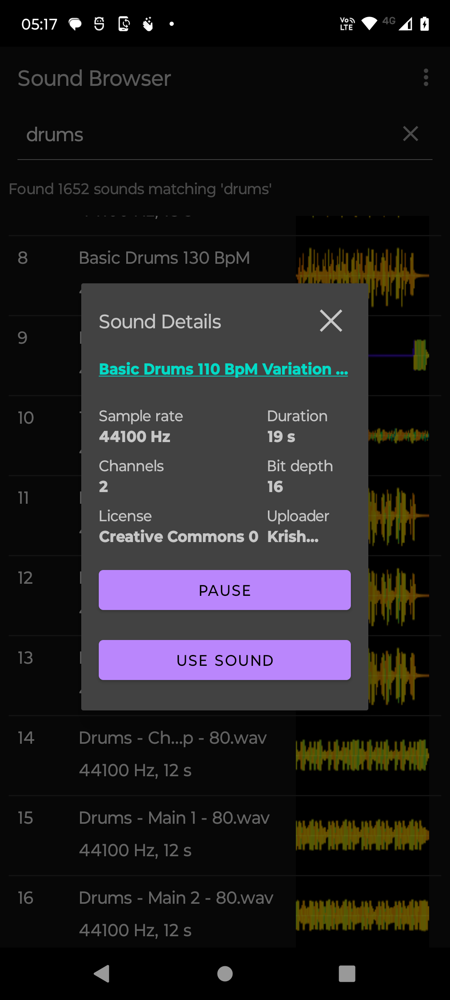

# sound-browser
Simple app demonstrating [ktor](https://ktor.io) HTTP-client and [Android Paging library](https://developer.android.com/topic/libraries/architecture/paging/v3-overview).

With SoundBrowser you can search, browse and play sounds from [freesound.org](https://freesound.org.)

All sound clips are covered by [Creative Commons 0](https://creativecommons.org/publicdomain/zero/1.0) license, and are shorter than 60 seconds of duration.
To find longer clips or sounds under some other license, go to freesound web site. Or you can change these limitations in FreeSoundHttpClient.kt.

The clip played is always a mp3 preview, not the original sound. In order to download the original sound, navigate to the sound's homepage from sound
details.

For building, load the project to Android Studio. You need a [freesound API key](https://freesound.org/apiv2/apply).
Once you have the key, add it to `gradle.properties` file and build.

> apikey="\<your api key here\>"

