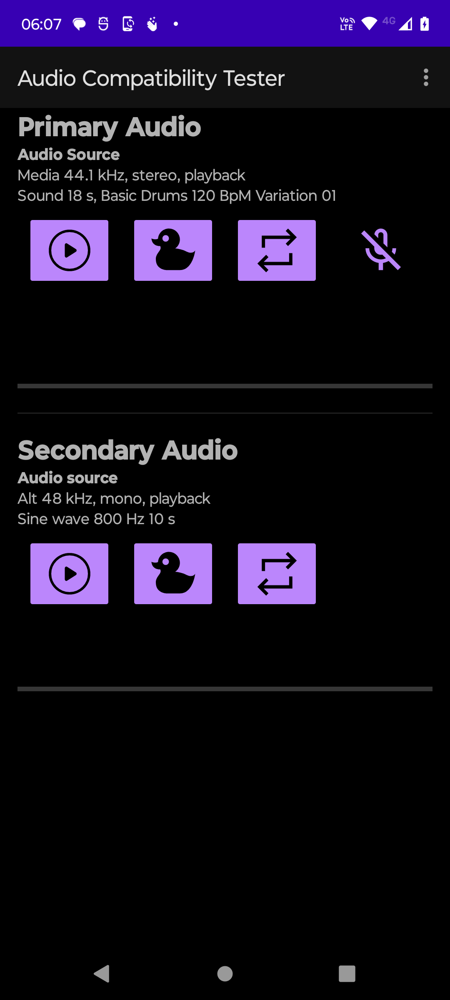
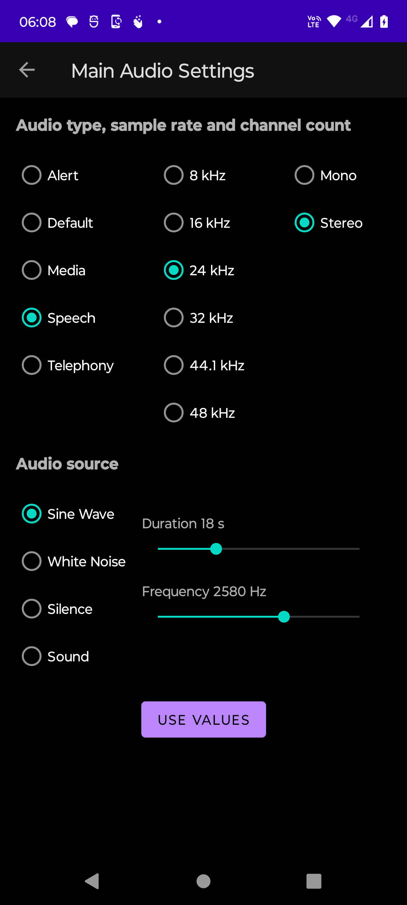
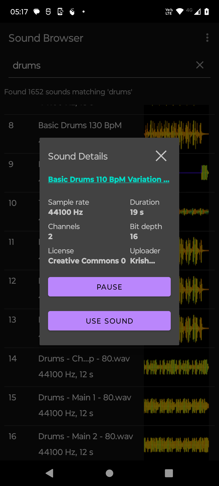
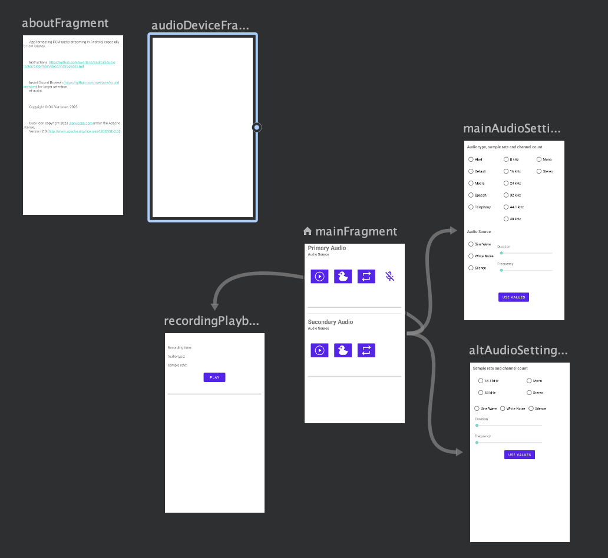

# Design document

## 1. Milestones

1. Main app main functionality
   - UI, main screen and settings screens
   - PCM player and recoder
   - Play recording screen
   - Overflow menu, list available audio devices
2. Companion app implementation
   - UI for searching and browsing sounds
   - HTTP client
3. Connect main app and companion app 
   - Communication with intents
   - Decode MP3 sounds to PCM for main app use
4. Implement duck and repeat states
5. Adopt native streaming library ([oboe](https://github.com/google/oboe))
6. Integrate to audio focus management (inter app functionality)

Contribution to Udacity capstone project covers milestones 1 - 3.

## 2. Application overview

Application is for testing PCM audio streaming on Android platform. Android comes in many flavors and audio subsystems have always custom implementation depending on the hardware used and the native audio drivers. 

Application has two main parts:

*The Main App*: The main app, *Audio Compatibility Tester*,  implements audio controls and audio stream settings. It also provides an audio device lists which gives and overview to device's audio environment.

*The Companion App*: With the companion app, [*Sound Browser*](https://github.com/overtane/sound-browser/blob/main/README.md), the user of the main app can select and download audio clips from sound database. Selected clips can be played in the main app.

The main objective of the app is to provide a tool for playing raw PCM format audio in different sample rates and with different [audio usages](https://source.android.com/docs/core/audio/attributes). It is also possible to mix two simultaneus audio streams and record audio while playback is active.

As result the app can tell:
- If fast mixer can be used.
- What is the audio buffer size in milliseconds.
- What is the latency of audio playback.
- Underruns during the playback.

User can also audibly verify the quality of playback and recording.

The app does not use Android's audio players, but implements custom player/recorder which use [AudioTrack](https://developer.android.com/reference/android/media/AudioTrack) and [AudioRecord](https://developer.android.com/reference/android/media/AudioRecord) classes. 

## 3. UI/UX

### 3.1 Navigation

The main app is Fragment-based. It consists of several fragments with inflable layout

- main fragment
- main audio settings fragment
- alt audio settings fragment
- recording playback fragment
- audio device list fragment
- about fragment

Navigation Controller is used for navigating between fragments. Basically all other fragments are reachable from main fragment. Back button or Up action from App bar takes always back to main fragment view. To change audio stream settings, both settings layouts have 'use' button for accepting new values and navigating back to main view.

Also two overflow menu targets, audio device list and about view, are reached by the nav graph. 

The companion app can be launched from overflow menu. This action sends a pending intent to the companion app. When user selects a sound from the companion app, the pending intent is applied and the main app is returned to foreground.

There are no other navigable views in companion app than the 'about' view from overflow menu. Sound selection is implemented as DialogFragment. The dialog opens up after sound item on the list is clicked.

### 3.2 Layouts

Layouts with data binding are used throughout the design of fragment layouts. `ContstraintLayout` is applied for most fragments. Sublayouts like `LinearLayout` or `TableLayout` is applied when it is feasible. 

List layouts (audio device list, search result list in the companion app) use `RecyclerView` combined with a `ViewHolder` class.

Image and string resources are stored under `res` directory. `<selector>` is applied to icons, either icon color or icon content when it is about to change depending on the state.

### 3.3 Animation

#### 3.3.1 Fragment Transitions

`MotionLayout` is used to animate fragment transitions in the main app between main fragment and settings fragments. The effect used is simple fade-in.

#### 3.3.2 Property Animations

Blinking microphone icon on main screen indicated ongoing recording. This is implemented with ObjectAnimator changing alpha property of the icon view.

There are several progress bars indicating audio playback progress. A binding adapter is used for updating the progress bar progress.

## 4. Local and Network Data

### 4.1 Data Sources

The companion app is designed for browsing the [freesound](https://freesound.org) data base. It implements a [ktor](https://ktor.io) client for accessing freesound's [RESTful API](https://freesound.org/docs/api/). The local model holding search results is Android's [Paging library v3](https://developer.android.com/topic/libraries/architecture/paging/v3-overview). Results are not stored to local database, because plain textual results are not very useful for the user without the related audio data. It is not feasible to download and store audio for all found sound items. We only download the selected sound, and that is done by the main app.

### 4.2 Network Resource Handling

The main app downloads and decodes the sound selected by the companion app. The data is in a
MP3 file. App gets the URL of the file embedded in extras of the returned intent. The file is downloaded and decoded immediately after reception of the intent. Download is handled by [MediaExtractor](https://developer.android.com/reference/android/media/MediaExtractor). When there is no connection, sound is not available and silence is played instead.

The companion app uses Picasso library to download waveform images shown on the list of sounds. The URLs of image are provided with the textual search results. A placeholder image is displayed if image is not available.

### 4.3 Persistent Data

The main app maintains persistent data in a [Proto DataStore](https://developer.android.com/topic/libraries/architecture/datastore#proto-datastore). As the amount of data is small  transactions are done synchronously. Proto DataStore is asynchronic by design.  The stored data is structured and defined in `user_prefs.proto` file in [Protocol Buffers](https://protobuf.dev) format.

## 5. Android System and Hardware Integration

### 5.1 Application Architecture

#### 5.1.1 Main App

The main app follows MVVM architecture.

Repositories are created by the main activity:

- Preferences repository holds user preferences and accesses Proto DataStore.
- Sound repository, accesses MP3 decoder, holds the decoded sound and decoder state. 

`MainViewModel.kt` has the central control on app functionality. It creates and controls *audio player and recorder components* and communicates with those using kotlin flows. These components are analogous to repositories providing data to the ViewModel and also communicating with the Android Framework via `AudioTrack` and `AudioRecord` instances. The ViewModel also reads and updates persistent user preferences, and accesses sound repository via state flows.

Another ViewModel, `SettingsViewModel.kt` has no backing store. Instead, it get the initial model as fragment parameter and returns settings values as fragment result to `MainViewModel`.
 

#### 5.1.2 Companion App

The architecture of the companion app is based on the [paging library architecture](https://developer.android.com/topic/libraries/architecture/paging/v3-overview#architecture). Repository layer user `PagingSource` to page content from HTTP client. ViewModel has a `Pager` object which passes data as a flow to UI's `PagingDataAdapter`. This adapter uses a view holder of `RecyclerView` to bind paging data to list items of the `RecyclerView`. 

### 5.2 Lifecycle management and Intents

Lifecycle management follows standard Android fragment lifecycles. View models hold the state while fragments are not present and on foreground. Audio instances (player and recorder) continue executing while the app is on the background. This is intentional and the app is later integrated to Android's audio focus management for handling inter-app audio requests.

Results from settings fragments are passed in bundles back to main fragment by FragmentResultListeners.

The main app and the companion app communicate via pending intent. When companion app is selected, the main app starts the companinon app with an intent. This intent embeds a pending intent in it's extras. The pending intent gets returned to main app when user selects a sound. Both apps specify `singleTop` as value for `launchMode` attribute of their MainActivites to handle app switch properly (`AndroidManifest.xml`). No new task instance is created, but the old one is reused and intent is received by `onNewIntent()` method. 

The companion app packege is added to `<queries>` section of the main app's manifest to make the companion app visible.

#### 5.2.1 Permissions

The main app requires `android.permission.RECORD_AUDIO` permission for accessing microphone and    `android.permission.INTERNET` permission for downloading MP3 files.

The companion app requires `android.permission.INTERNET` permission for making HTTP requests.

### 5.3 System Hardware

The main app uses microphone for recording while playing duplex audio streams. 
