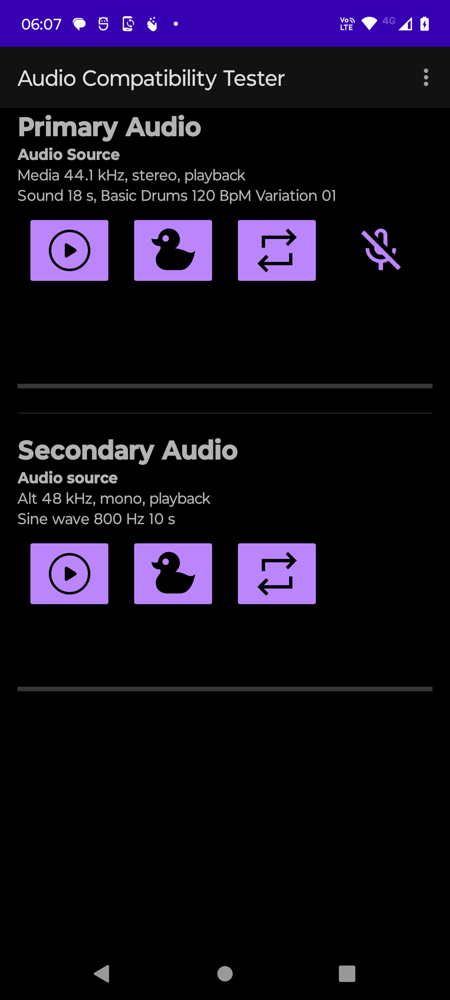
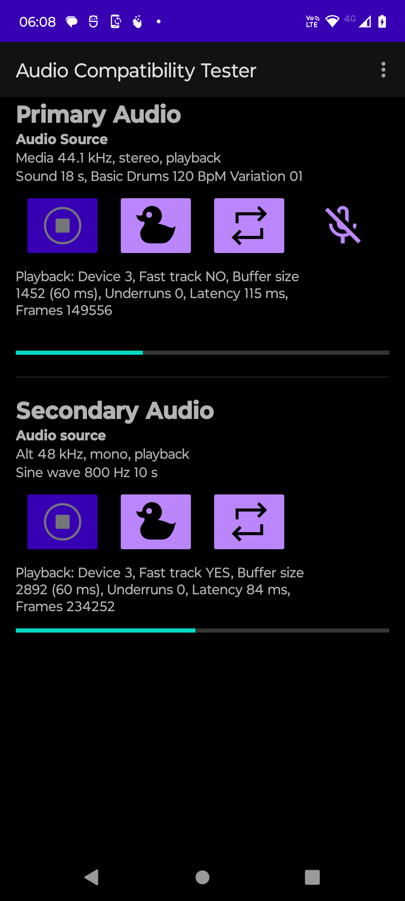
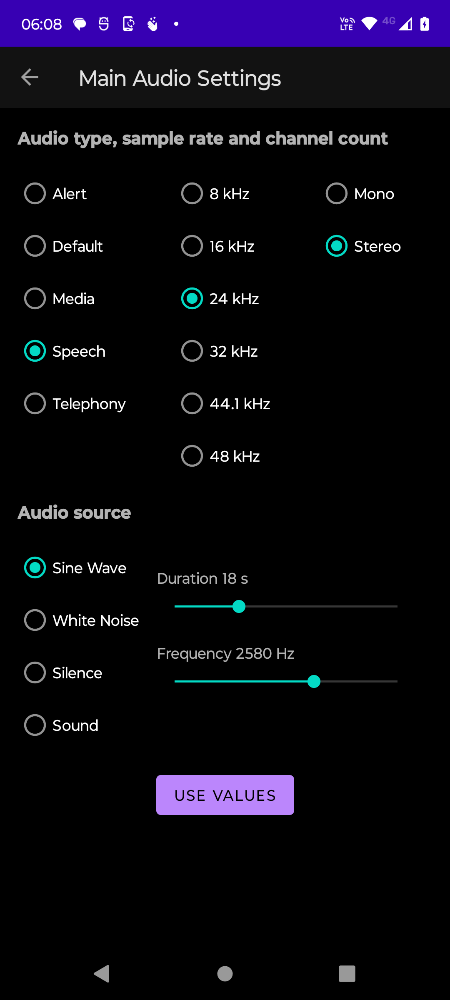
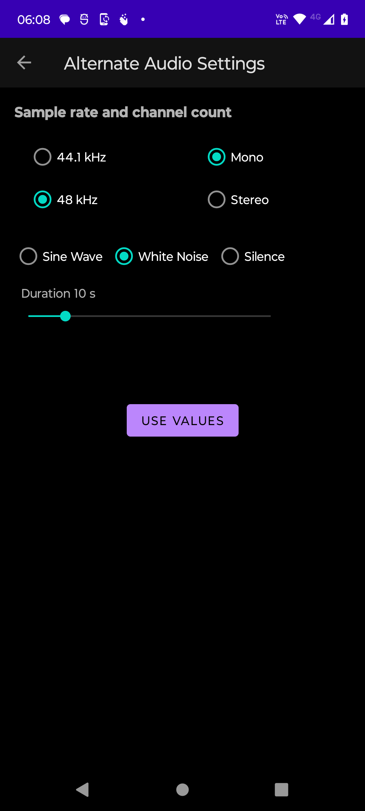

# Instructions

## Main Screen

The main screen has sections for primary and secondary audio. Each section has control buttons: play/stop, duck, repeat. Above the controls, you can see the audio stream and sound source properties. Below the controls you see streaming results:

- Id of the audio device used. A list of all devices is available in the overflow menu.
- Can [audio fast track](https://source.android.com/docs/core/audio/latency/design#trackCreation) be used? YES/NO
- Current buffer size in milliseconds
- Underruns during playback
- Internal latency in milliseconds
- Number of streamed frames

You can play two sounds at the same time, and the secondary will get mixed with the primary, Both streams have individual results.

Primary audio may be duplex audio when you are also able to record during the playback. When duplex audio type is selected, the mic icon on the right side of the controls is enabled.

Note 1: latency calculation uses the stream's audio timestamps and the algorithm is adapted from the [oboe project](https://github.com/google/oboe/blob/0abad3e3412234d9a345755e7ad6b72390110ab1/src/aaudio/AudioStreamAAudio.cpp#L821)

Note 2: audio ducking (i.e. volume reduction) and repeat modes are *not yet implemented*.

## Settings

Tap the audio source description above the control buttons to enter settings. Select audio type, sample rate, channel count, and audio source. The 'Use values' button changes the audio source and takes you back to the main screen.

There are separate settings for primary and secondary audio.

### Audio type

Audio type is mapped to [Android audio context](https://source.android.com/docs/core/audio/attributes#contexts). Different contexts have for example different audio volume levels (This depends on Android implementation). Default, speech, and telephony types create duplex streams which means simultaneous playback and record.

## Recording playback

You can play back the latest recording when tapping the mic icon after the stream is stopped. This takes you to the 'recording playback' screen.

## Overflow menu

- Audio devices: List of audio devices, corresponding device IDs, and device attributes.
- Sound Browser: Opens [sound browser](https://github.com/overtane/sound-browser). Can be used to select a sound from [freesound](https://freesound.org) database for playback.
- About: Credit and copyright

## Using sound browser

- Build and install [sound browser](https://github.com/overtane/sound-browser). You need to [register](https://freesound.org/home/register/) to freesound to get an API key.
- Selecting 'Sound Browser' from the overflow menu takes you to the app.
- Search the sound using free text search.

